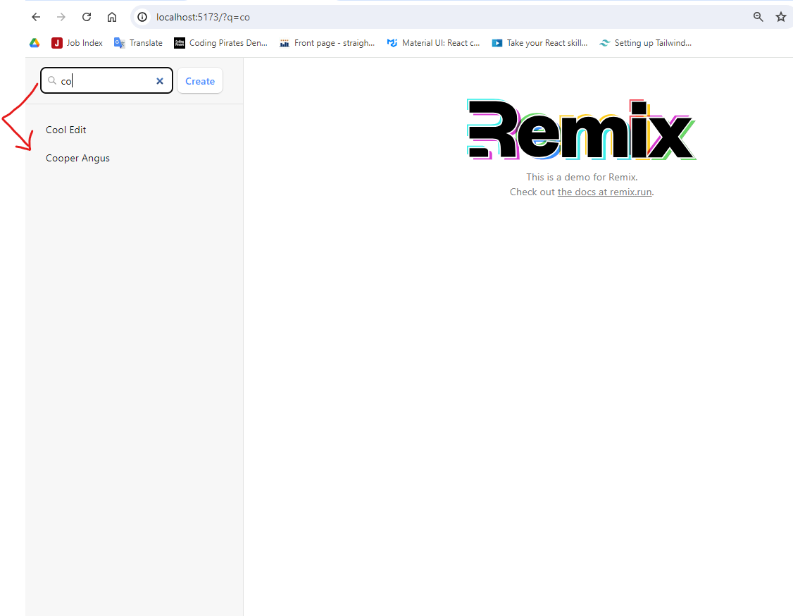
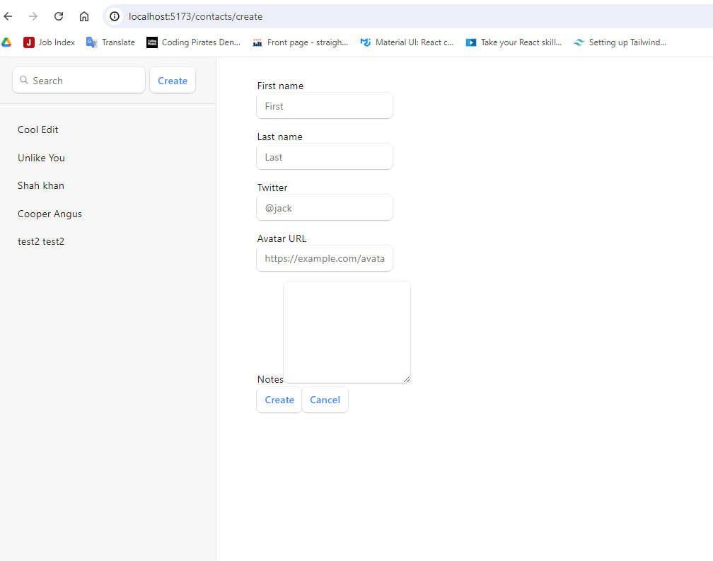

# CRUD Operations on Contacts

This project implements CRUD (Create, Read, Update, Delete) operations on contacts with the following features:

1. **Remix Routing**
   - Implemented routing for navigation within the application.

2. **Nested Routes and Outlets**
   - Utilized nested routes and outlets to structure the application.

3. **Dynamic Routes**
   - Integrated dynamic routes for handling individual contact details.

4. **Loader and Action Functions**
   - Created loader functions for fetching data and action functions for data mutations.

5. **Full CRUD Functionality**
   - Enabled full CRUD operations: Create, Read, Update, and Delete contacts.

6. **Form Validation with Zod**
   - Added validation for form inputs using Zod to ensure data integrity.

7. **Remix Form Submission and useFetcher Function**
   - Utilized Remix's form submission mechanism and `useFetcher` function for handling form actions.

8. **Error Handling with Error Boundaries**
   - Implemented error boundaries to manage and display errors gracefully.

